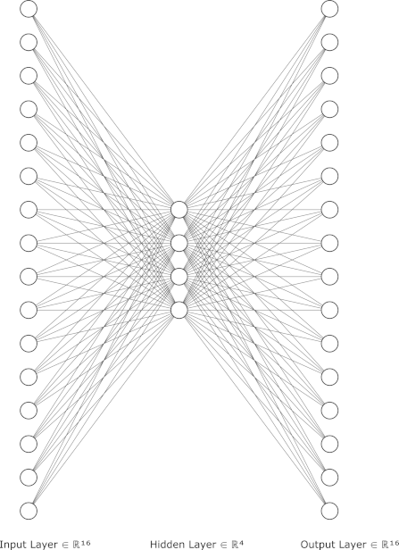

# Dyspyosis - Method Documentation

## Introduction

Dyspyosis is a computational method designed to assess and quantify the degree of dysbiosis within microbiome samples. 
It is based on the concept derived from the [Anna Karenina principle] in ecology and microbiology. This principle 
suggests that a healthy ecosystem operates within a narrow range of functional configurations, while disturbances can 
lead to a multitude of dysbiotic states. Dyspyosis aims to identify these states by evaluating the microbial abundance 
in each sample from a dataset, providing insights into the ecosystem's balance or imbalance.

## Rationale

The foundational idea behind Dyspyosis is inspired by the [Anna Karenina principle], which, when applied to ecological 
and microbiological contexts, posits that successful ecosystems exhibit limited variation in their functional states. 
Conversely, disturbances within these ecosystems can manifest in numerous ways, disrupting the balance and leading to 
dysbiosis. 

Dyspyosis employs an autoencoder, a type of neural network. This model is trained to compress (encode) and then 
reconstruct (decode) the input data, effectively learning the "rules" that define a well-functioning ecosystem. Samples 
that deviate from these rules—indicative of dysbiosis—are less accurately reconstructed by the autoencoder, 
highlighting the extent of their deviation from the norm.

## Implementation Details

### Overview

The core of Dyspyosis is an autoencoder architecture designed to process microbiome data, specifically the abundance of 
different genera/species within samples. This architecture is structured to capture the underlying patterns that 
characterize non-dysbiotic states, enabling the identification of samples that do not conform to these patterns.

### Architecture

The autoencoder used in Dyspyosis features a simple encoder-decoder structure, which is composed of the following layers:

- **Input Layer:** The number of neurons in this layer corresponds to the number of genera/species represented in the 
input data. It serves as the entry point for the data into the network.
- **Hidden Layer:** A single hidden layer with a configurable number of nodes. This layer is where the input data is 
compressed into a lower-dimensional representation, capturing the essential information needed to reconstruct the input.
- **Output Layer:** Mirroring the input layer, the output layer has the same number of neurons as there are 
genera/species in the input data. It is responsible for reconstructing the input data from the compressed 
representation generated by the hidden layer.



All layers in the Dyspyosis autoencoder are fully connected, meaning each node in one layer is connected to every 
nodes in the subsequent layer.

The network has been implemented in Python using the [Keras] library.

### Configuration and Recommended Settings

The number of nodes in the hidden layer is a key parameter that can be adjusted based on the complexity of the input 
data and the desired granularity of the dysbiosis quantification. A larger number of nodes allows the network to 
capture more detailed patterns in the data. However, 
it also increases the computational resources required for training and the risk of overfitting to the training data.

For relatively simple ecosystems (e.g. the oral microbiome at genus level) the default setting of four nodes can be used.
Ss ecosystems become richer in species, the number of nodes in that layer should be increased. For instance for the
gut microbiome (at genus level) better performance is obtained with six or eight layers. 

To enrich the input data, it is rarefied multiple times using different seeds to create unique, slightly different 
version of the input for training. It is recommended to set the ```rarefication_count``` so that the total sample 
count, multiplied by the rarefication_count exceeds 10k. Training typically needs to run for 2000 - 4000 epochs.

[Anna Karenina principle]: https://en.wikipedia.org/wiki/Anna_Karenina_principle
[autoencoder]: https://en.wikipedia.org/wiki/Autoencoder
[Keras]: https://keras.io/